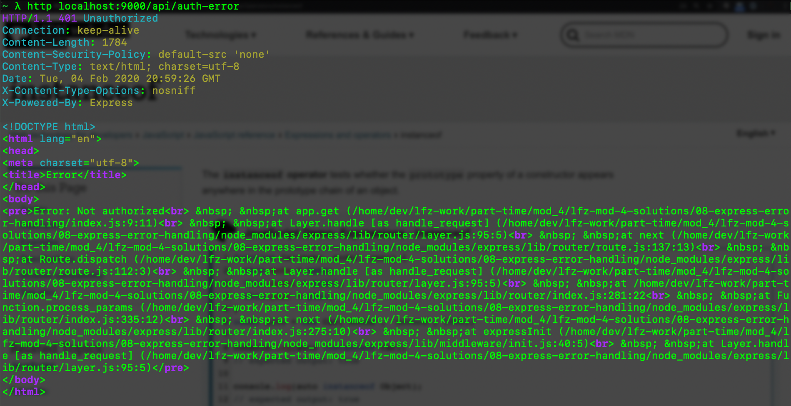
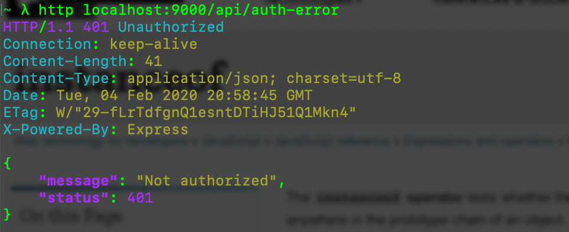

# express-error-handling

This lesson covers one of the ways that an express server can handle errors utilizing the default error handler and a custom error class.

### Before You Begin

Be sure to check out a new branch (from `master`) for this exercise. Detailed instructions can be found [**here**](../../guides/before-each-exercise.md). Then navigate to the `exercises/08-express-error-handling` directory in your terminal.

### Exercise

1. Look at the `package.json` file to see what **dependencies** and **scripts** your solution will utilize.
1. Install the required dependencies by running `npm install`.
1. Brush up on [HTTP Status Codes](https://developer.mozilla.org/en-US/docs/Web/HTTP/Status)
1. Look over the `index.js` file to familiarize yourself with the pre-built endpoints.
1. Start your express server.
1. From your dev environment use [HTTPie](https://httpie.org) to test some of the endpoints and note the output.
    - **Example:** http `localhost:9000/api/auth-error`
1. By default express handles errors by sending HTML back to the client, for most APIs this isn't useful. Usually we want responses back as JSON, even for errors, this allows the client to decide how and where to display the errors.
1. Read about [Error Handling](https://expressjs.com/en/guide/error-handling.html) in Express.
1. Read about [The Default Error Handler](https://expressjs.com/en/guide/error-handling.html#the-default-error-handler) in Express.
1. Read About [Writing Error Handlers](https://expressjs.com/en/guide/error-handling.html#writing-error-handlers) for Express.
1. Look over the custom error object in the `api_error.js` file.
1. In the `index.js` file create a custom default error handler
    1. It should check if the error thrown is an [instanceof](https://developer.mozilla.org/en-US/docs/Web/JavaScript/Reference/Operators/instanceof) the `ApiError` class.
    1. If it is an `ApiError` you should use its `status` property to set the response status code and its `message` property as the `message` property in the response.
    1. If it is **NOT** an `ApiError` that was thrown, the status should default to `500` and the message to `Internal Server Error`.
    1. Regardless of the type of error thrown the response should look like the following:
    ```JAVASCRIPT
    {
      "message": "Not authorized",
      "status": 401
    }
    ```

#### Before Error Handling Expected Output

<p align="middle">
  
</p>

#### After Error Handling Expected Output

<p align="middle">
  
</p>

### Submitting Your Solution

When your solution is complete, return to the root of your `lfz-mod-4-lessons` directory. Then commit your changes, push, and submit a Pull Request on GitHub. Detailed instructions can be found [**here**](../../guides/after-each-exercise.md).

### Quiz

- ADD QUIZ QUESTIONS
